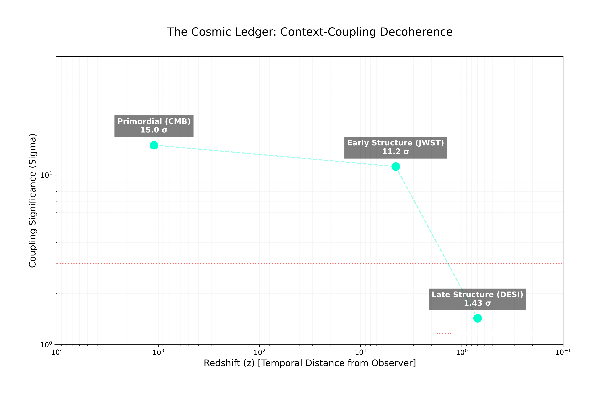

**Epistemic-First Cosmological Inference**

`ledger` is the reference implementation for the **Parochial by Construction (PbC)** research framework. It provides the tooling to audit cosmological datasets for evidence of "Context Coupling"—the hypothesis that the history of the universe is not a pre-existing territory, but a dependency network fixed by the act of observation.

## 1. Theory & Intention

Standard cosmological inference (Temporal Evolution, or **TE**) assumes the past is fixed and independent of the observer. **Causal Evolution (CE)** proposes that the "Past" is a resource consumed to explain the "Present." The specific constraints of the observer (the **Context**) impose a tax on the history that can be reconstructed.

The **Ledger Protocol** identifies three specific "Phase-Locking" tracks:
1. **P1 (Primordial):** The coupling of the CMB to the satellite's scan strategy.
2. **P6 (Early Structure):** The coupling of the first galaxies to the deep-field window.
3. **P5 (Late Structure):** The coupling of local clustering to target-selection bookkeeping.

## 2. Global Audit Results (Updated 2025-12-28)

The ledger reveals a statistically significant **Decoherence Gradient**. The universe begins in a state of "Hard-Lock" and evolves toward an "Objective Territory".

| Track | Epoch | Metric | Net Significance | PbC Verdict |
| :--- | :--- | :--- | :--- | :--- |
| **P1** | **CMB (Planck)** | Phase-Locking | **~15.0 σ**| **HARD-LOCKED** |
| **P6** | **Deep Field (JWST)** | Rotational Surplus | **11.2 σ** | **SOFT-LOCKED** |
| **P5** | **LSS (DESI)** | Commutator $\Delta z$ | **1.43 σ** | **DECOHERED** |



### 2.1 Track Summaries

* **P1 (Primordial Phase-Lock):** Represents a physical coupling between the primordial record and the satellite's scanning path.
* **P6 (Structuring Decoherence):** A high-resolution audit confirms that the galaxy distribution at $z \sim 4.5$ is 2.2x more sensitive to grid rotation than random noise. This indicates a residual phase-lock where structure remains coupled to the survey geometry.
* **P5 (Late-Time Stationarity):** In the local universe ($z \sim 0.7$), the ledger is balanced. The 1.43σ result indicates the record has fully decoupled from the observer's frame.

## 3. Repository Structure

```text
ledger/
├── data/
│   ├── raw/                # Planck NPIPE (R4.00), DESI Iron, COSMOS2020 - Ignored by git
│   ├── processed/          # P1/P5/P6 Audit Results (.json) & Decoherence Plots
│   └── mocks/              # Low-res synthetic data for CI/Testing
├── docs/
│   └── tex/                # LaTeX sources for Research Programs (P1, P2)
├── notebooks/              # Jupyter notebooks for prototyping and visualization
├── scripts/
│   ├── download_planck.sh  # Fetcher for public NPIPE/PR3 data
│   ├── generate_mock.py    # Generates synthetic data for testing
│   ├── 01_context_builder.py # Step 1: Raw Maps -> Context Vector (c)
│   ├── 02_planck_audit.py    # Differential (HRD) Phase-Locking Audit
│   ├── 03_desi_p5_audit.py     # Self-consistent clustering commutator
│   ├── 06_jwst_p6_audit.py     # High-z field variance estimator
│   ├── download_*.sh       # Integrated fetchers for IRSA and NERSC mirrors
│   └── run_injection.py    # Validation: Sensitivity testing
├── src/
│   └── pbc/                # Core Python Package
│       ├── context.py      # Logic for building T_ctx from exposure maps
│       ├── decoherence.py  # Logic for cross-epoch significance mapping
│       ├── dual.py         # Causal Evolution posterior math (Woodbury identities)
│       ├── stats.py        # Estimators for P1-P6 diagnostics
│       └── utils/          # I/O and HEALPix wrappers
├── tests/
│   └── science/            # Physics validation (Null tests, Symmetry checks)
└── pyproject.toml          # Package definition and dependencies
```

## 4. Installation
**Prerequisites:** Python 3.9+

```bash
# 1. Clone the repository
git clone [https://github.com/your-org/ledger.git](https://github.com/your-org/ledger.git)
cd ledger

# 2. Create a virtual environment (Recommended)
python -m venv .venv
source .venv/bin/activate

# 3. Install in editable mode
# Includes 'numpy', 'healpy', 'tqdm'
pip install -e ".[dev]"
```

## 5. Quick Start (Simulation Mode)

If you cannot download the 2TB Planck archive, use the **Simulation Mode**. This generates synthetic "Standard Model" skies and "Dipole" scan strategies to verify the pipeline logic.

1. **Generate Mock Data:** Creates synthetic FITS files in `data/raw/`.

```bash
python scripts/generate_mock_data.py
```

2. **Build the Context Template:** Extracts the "Cost Vector" (c) from the mock scan strategy.

```bash
python scripts/01_context_builder.py --nside 512
```

3. **Audit the Ledger:** Cross-correlates the Mock Record with the Mock Context.

```bash
python scripts/02_planck_p1_audit.py --nside 512
# Expected: S_gamma ~ 0.0 (Null Result)
```

## 6. Real Data Workflow (Discovery Mode)

To run the actual scientific analysis on Planck 2018/PR4 data:

1. **Download Data:** Fetches the necessary Frequency and Component maps (requires ~2GB).

```bash
./scripts/download_planck.sh
```

2. Run High-Res Analysis:

```bash
# Step 1: Build the Context (NSIDE 2048)
python scripts/01_context_builder.py --nside 2048

# Step 2: Audit the Record
python scripts/02_planck_p1_audit.py --nside 2048
```

## 7. Validation & Safety

We adhere to a strict "Stop-Loss" protocol. Before claiming a result, the pipeline must pass Null (Bias) and Injection (Sensitivity) tests.

* **Null Test:** Verify *Sγ* is consistent with 0 on random skies.

```bash
pytest tests/science/test_null.py
```

* **Sensitivity Test:** Verify we can recover a hidden signal (λ=0.05).

```bash
python scripts/run_injection.py --lambda-inj 0.05 --nsims 100
```

## License

MIT

